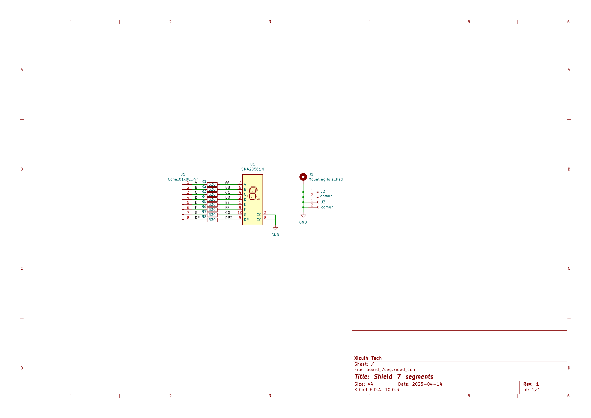
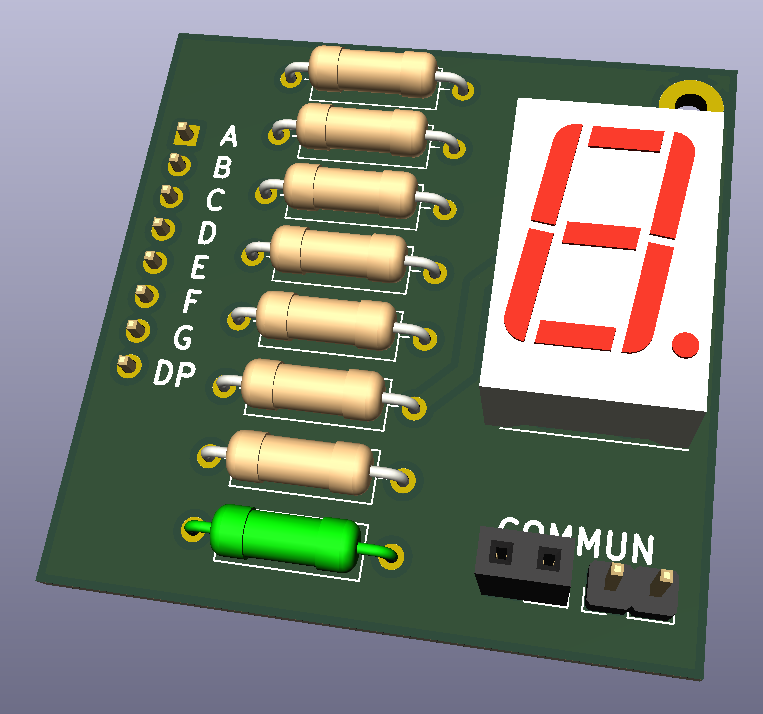

# Board 7-Segment Display

Este proyecto consiste en una placa de circuito impreso (PCB) diseñada en KiCad para controlar y visualizar información utilizando displays de 7 segmentos.

## 📋 Descripción

El objetivo de este diseño es proporcionar una interfaz visual simple mediante displays de 7 segmentos.
*(Aquí puedes añadir más detalles: ¿Es para un microcontrolador específico? ¿Qué tamaño de displays usa? ¿Es ánodo o cátodo común?)*

## ⚙️ Características Técnicas

*   **Software de Diseño**: KiCad 8.0 (o compatible)
*   **Capas**: 2 capas (Top/Bottom) *[Ajustar si es diferente]*
*   **Dimensiones**: *[Añadir dimensiones si se conocen]*

## 📁 Archivos del Proyecto

*   `board_7seg.kicad_sch`: Esquemático del circuito.
*   `board_7seg.kicad_pcb`: Diseño del PCB (Layout).
*   `board_7seg.kicad_pro`: Archivo de proyecto principal.

## 🔧 Montaje y BOM

La lista de materiales (BOM) se puede generar desde el esquemático. Los componentes principales incluyen:
*   Displays de 7 segmentos.
*   Resistencias limitadoras de corriente.
*   Conectores (Headers).

## 🚀 Uso

1.  Abrir `board_7seg.kicad_pro` con KiCad.
2.  Revisar el esquemático para entender las conexiones.
3.  Generar los archivos Gerber desde el editor de PCB para la fabricación.
